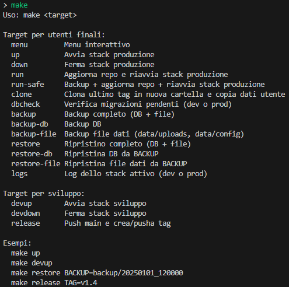
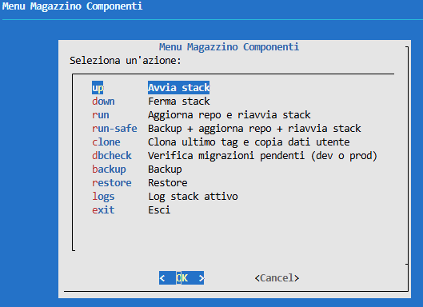
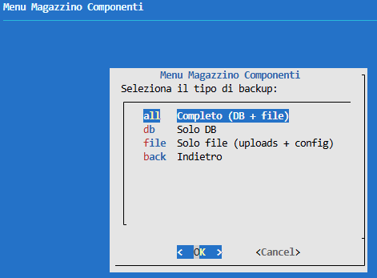
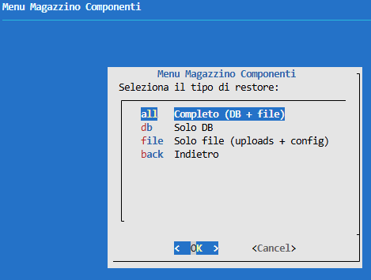
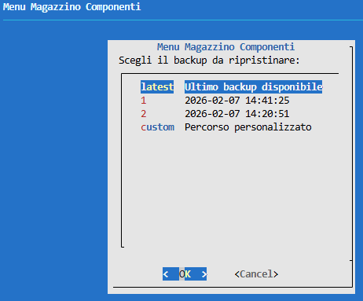
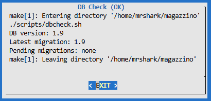
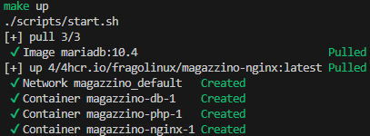
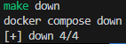
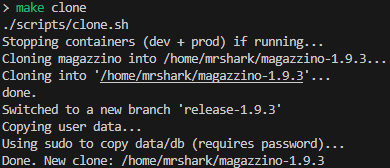
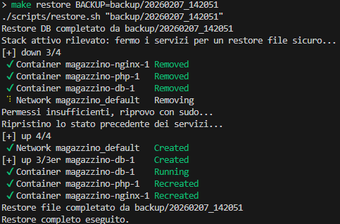

# Magazzino Componenti Elettronici (Docker)

Questo repository contiene una app PHP 8.0 servita da Nginx + PHP-FPM con database MariaDB.
Tutti i dati persistenti stanno in `data/` e i backup in `backup/`.

## Nota importante (Linux/WSL consigliato)

La migliore esperienza si ottiene su **Linux o WSL**. Le aggiunte recenti (menu `dialog`, comandi `make`, script `*.sh` per backup/restore avanzati) funzionano solo in ambienti Unix-like.
Su Windows “puro” restano validi gli script PowerShell, ma il menu interattivo e i target Make, che semplificano molto l'uso e non richiedono conoscenze avanzate di Docker e Linux, non sono disponibili.

## Prerequisiti

- Docker + Docker Compose (Windows, Linux o WSL)
- Porta 80 libera sul host (usata da Nginx; necessaria per i QR code senza porta)
- Linux/WSL: `git`, `make`, `dialog` (oltre a Docker)

## Crediti e riferimenti

Questo progetto si basa sul lavoro originale di RG4Tech (Gabriele Riva).
Grazie per lo sviluppo e per aver condiviso il progetto con la community.

- Autore: RG4Tech (Gabriele Riva)
- Sito web del progetto: https://rg4tech.altervista.org/forum/thread-463-post-576.html
- Video di presentazione: https://www.youtube.com/watch?v=vZVBEfRnHZI

## TL;DR (avvio rapido)

Windows (PowerShell):
```powershell
git clone https://github.com/fragolinux/magazzino.git
cd magazzino
.\scripts\start.ps1
```

Linux/WSL (bash):
```bash
git clone https://github.com/fragolinux/magazzino.git
cd magazzino
make menu
```
In alternativa:
```bash
make up
```

## TL;DR (aggiornamento rapido, Linux)

```bash
make clone
cd "$(ls -d ../magazzino-* 2>/dev/null | sort -V | tail -n1)"
make run
```

Apri `http://localhost` e accedi con `RG4Tech / 12345678`.
Per cambiare password o altre impostazioni avanzate, leggi il resto del README.

## Prerequisiti
## Struttura

- `magazzino/` sorgenti PHP dell'app
- `magazzino_db.sql` dump iniziale del database
- `docker/` setup Nginx + PHP
- `docker-compose.yml` avvio utente finale (immagini prebuild)
- `docker-compose.dev.yml` avvio sviluppo (sorgenti locali)
- `data/` dati persistenti (DB + log)
- `.env` configurazione locale
- `backup/` cartella backup
- `overrides/` override per l'uso in Docker

## Avvio rapido (utente finale)

1) Copia `.env.example` in `.env` (include credenziali DB di default).
   Facoltativo: personalizza utente/password DB.

2) Avvia i container (consigliato tramite script):
Windows (PowerShell):
```powershell
.\scripts\start.ps1
```

Linux/WSL (bash):
```bash
make menu
```
In alternativa:
```bash
make up
```
Nota: `start.sh` esegue un `docker compose pull` prima dell'avvio per aggiornare le immagini.
Su Windows, `start.ps1` fa lo stesso.

App disponibile su `http://localhost`.

Login di default:
- Username: `RG4Tech`
- Password: `12345678`

## Avvio rapido (sviluppo)

Per lavorare sui sorgenti locali (hot reload), usa il compose di sviluppo:

Windows (PowerShell):
```powershell
docker compose -f docker-compose.dev.yml up --build
```

Linux/WSL (bash):
```bash
make devup
```

Oppure usa gli script di avvio:
Windows (PowerShell):
```powershell
.\scripts\start-dev.ps1
```

Linux/WSL (bash):
```bash
./scripts/start-dev.sh
```

Facoltativo: fissa una versione specifica delle immagini (esempio `v1.1`):
Windows (PowerShell):
```powershell
$env:MAGAZZINO_TAG="v1.1"
docker compose up -d
```

Linux/WSL (bash):
```bash
MAGAZZINO_TAG=v1.1 docker compose up -d
```

## Note WSL

- Per prestazioni migliori, tieni il repo dentro il filesystem WSL e lancia `docker compose` da WSL.
- Se usi Docker Desktop, assicurati che l'integrazione WSL sia attiva (altrimenti non serve).
- Se usi WSL su Windows e vuoi accedere dall'esterno (LAN), serve esporre la porta 80 con un portproxy di Windows (punta all'IP WSL, che può cambiare dopo reboot).
  Apri PowerShell come amministratore (tasto destro sul menu Start → Terminale (Amministratore)) e lancia:
```powershell
Set-Location "\\wsl.localhost\<Distro>\home\<utente>\magazzino"
powershell -ExecutionPolicy Bypass -File .\scripts\win-expose-80.ps1
```
  Sostituisci `<Distro>` con il nome della tua distribuzione WSL (es. `Ubuntu-24.04`) e `<utente>` con il tuo username in WSL.
  Se non sai il nome della distribuzione, puoi scoprirlo da PowerShell con `wsl -l -v`.
  Questa procedura vale per WSL su Windows.
  Se usi una distro Linux non-WSL, apri la porta 80 nel firewall del sistema (es. `ufw`, `firewalld`) se necessario.
  Se usi Docker Desktop su Windows, la porta 80 viene pubblicata direttamente sull'host, ma potresti comunque dover aprire il firewall di Windows per l'accesso dalla LAN.

Avvio pulito (Windows + WSL Ubuntu 24.04, usando lo script di setup):
```powershell
wsl --install -d Ubuntu-24.04
wsl -d Ubuntu-24.04
```
Nota importante: al primo `wsl -d Ubuntu-24.04` ti verrà chiesto di creare utente e password.
Completa quel passo, poi continua con i comandi successivi (non copiare tutto in un unico blocco).
```powershell
wsl --terminate Ubuntu-24.04
wsl -d Ubuntu-24.04 -u root -- bash -lc "curl -fsSL https://raw.githubusercontent.com/fragolinux/magazzino/refs/heads/main/setup_wsl_ubuntu.sh -o /tmp/setup_wsl_ubuntu.sh && bash /tmp/setup_wsl_ubuntu.sh --with-zsh"
wsl --terminate Ubuntu-24.04
wsl -d Ubuntu-24.04
```

## Inizializzazione database

- Al primo avvio (cartella `data/db` vuota), MariaDB importa `magazzino_db.sql`.
- Ad ogni avvio, il container PHP esegue migrazioni idempotenti per allineare lo schema alle ultime versioni.
- Nome/utente/password DB vengono creati da `.env`.
- Le migrazioni vengono eseguite automaticamente con l'utente root del DB (usando `DB_ROOT_PASSWORD`),
  mentre l'app continua a usare `DB_USER/DB_PASS`. Non sono richieste azioni manuali da parte dell'utente.

Per reimportare da zero (DISTRUGGE i dati):
Windows (PowerShell):
```powershell
Remove-Item -Recurse -Force .\data\db
docker compose up -d
```

Linux/WSL (bash):
```bash
rm -rf ./data/db
docker compose up -d
```

## Credenziali DB: creare e recuperare

Setup consigliato: imposta le credenziali in `.env` prima del primo `up`.
Se al primo `make run` vedi warning del tipo "The DB_* variable is not set", significa che manca `.env`:
copia `.env.example` in `.env` e personalizza i valori.
Login app di default: `RG4Tech / 12345678`.

Esempio `.env`:
```
DB_NAME=magazzino_db
DB_USER=magazzino_app
DB_PASS=change_me
DB_ROOT_PASSWORD=change_me_root
HTTP_PORT=80
```

Recupero credenziali:
- Controlla `.env` sul host.
- Oppure dentro il container DB:
Windows (PowerShell):
```powershell
docker compose exec db printenv MARIADB_USER MARIADB_PASSWORD MARIADB_DATABASE
```

Linux/WSL (bash):
```bash
docker compose exec db printenv MARIADB_USER MARIADB_PASSWORD MARIADB_DATABASE
```

## Override DB per Docker

Il file originale `magazzino/includes/db_connect.php` resta quello dell'autore.
Per Docker usiamo l'override `overrides/db_connect.php`, montato dal compose.
Così puoi aggiornare `magazzino/` sovrascrivendo tutto senza perdere la modifica.

## Cartella dati locale

Tutti i dati persistenti stanno in `data/`:

- `data/db/` file MariaDB
- `data/nginx-logs/` log Nginx
- `data/php-logs/` log PHP-FPM
- `data/uploads/` datasheet PDF e immagini componenti (persistenti e condivisi tra Nginx/PHP)

Backup = copia `data/` + `.env` + `magazzino_db.sql` oppure usa gli script sotto.

### Verifica automatica cartelle (volumi)

Gli script di avvio (`scripts/start.*` e `scripts/start-dev.*`) eseguono una verifica preliminare:
creano le cartelle dei volumi se mancanti e aggiungono un `.gitkeep` per mantenerle tracciate
anche su installazioni precedenti al commit che le ha introdotte.

Script dedicati (eseguibili anche manualmente):
- `scripts/ensure-dirs.sh`
- `scripts/ensure-dirs.ps1`

## Backup (DB + file)

I backup finiscono in `backup/<timestamp>/` e contengono:

- `db.sql` (dump completo)
- `files.tar.gz` (archivio di `data/uploads` + `data/config`)

Esegui backup:

Windows:
```powershell
.\scripts\backup.ps1
```

Linux/WSL (bash):
```bash
make backup
```

Backup separati (Linux/WSL):
```bash
make backup-db    # solo DB
make backup-file  # solo file (uploads + config)
```

## Comandi Make (Linux)

Da root del repo (Linux):

```bash
make menu       # menu interattivo
make up         # avvio prod (./scripts/start.sh)
make down       # stop prod (docker compose down)
make run        # aggiorna repo + restart prod (git pull --rebase + ./scripts/start.sh)
make run-safe   # backup + aggiorna repo + restart prod (./scripts/backup.sh + ./scripts/start.sh)
make clone      # clone pulito + copia dati utente (./scripts/clone.sh)
make dbcheck    # verifica migrazioni pendenti (./scripts/dbcheck.sh)
make backup     # backup completo (DB + file) (./scripts/backup.sh)
make backup-db  # backup solo DB (./scripts/backup_db.sh)
make backup-file # backup solo file (./scripts/backup_files.sh)
make restore     # restore completo (DB + file) (./scripts/restore.sh)
make restore-db  # restore solo DB (./scripts/restore_db.sh)
make restore-file # restore solo file (./scripts/restore_files.sh)
make logs       # log stack attivo (docker compose logs -f --tail=200)
make devup      # avvio dev (./scripts/start-dev.sh)
make devdown    # stop dev (docker compose -f docker-compose.dev.yml down)
make release    # push main + tag (git push + git tag)
```

Nota: `make dbcheck` usa `scripts/dbcheck.sh` e legge `DB_ROOT_PASSWORD` da `.env`.
Non modifica la cartella `magazzino/`.

## Screenshot Menu e Comandi

1. `make` (help e target disponibili)  
   
2. Menu principale  
   
3. Menu backup  
   
4. Menu restore  
   
5. Sottomenu restore (selezione backup)  
   
6. `make dbcheck`  
   
7. `make up`  
   
8. `make down`  
   
9. `make clone`  
   
10. `make restore`  
    

## Restore (DB + file)

Ripristina da un backup specifico:

Windows:
```powershell
.\scripts\restore.ps1 -BackupPath .\backup\20250101_120000
```

Linux/WSL (bash):
```bash
make restore BACKUP=backup/20250101_120000
```

Se non specifichi il path, gli script usano l'ultimo backup disponibile.

Restore separati (Linux/WSL):
```bash
make restore-db
make restore-file
```

Nota operativa:
- Backup file: se i servizi sono attivi, viene mostrato un avviso ma il backup prosegue.
- Restore file: se i servizi sono attivi, vengono fermati e riavviati automaticamente.

## Note

- In Docker l'app usa `DB_HOST/DB_NAME/DB_USER/DB_PASS` da ambiente tramite l'override.
- Host DB di default in Docker: `db` (già impostato nel `docker-compose.yml`).
